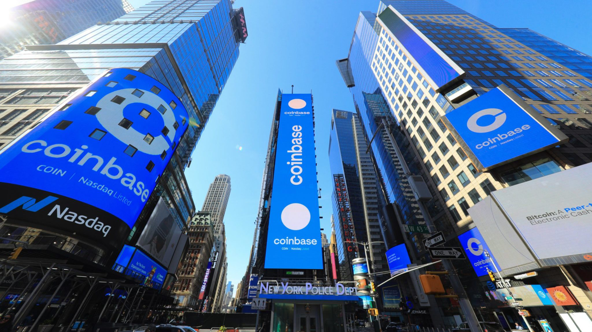

# Coinbase inc, Case Study
## By Greg Stevenson
___
Coinbase is a cryptocurrency exchange and payment services company founded in June 2012 by
Brian Armstrong and Fred Ehrsam with services becoming available in October 2012. 
Making Coinbase the first custodied cryptocurrency exchange. 
The circumstances that gave rise to the idea of Coinbase came to Armstrong during his time as a software engineer for Airbnb. 
While at Airbnb he worked with cross border payments and saw how difficult and cumbersome it was using the traditional financial system and he looked for a solution. 
In his search he browsed the online community website Reddit.
This is where Armstrong met Fred Ehrsam and found Bitcoin. 

Bitcoin offered the solution to cross border payments Armstong was looking for. 
The Coinbase co-founders identified their answer to one problem but came across another issue. 
This new problem was that Bitcoin wasn't easy for safe purchase. 
The solution for this new problem was their own company Coinbase. 
Coinbase would offer customers an user-friendly and secure way to purchase and trade Bitcoin and eventually other cryptocurrencies.

Brian Armstong and Fred Ehrsam applied to Y Combinator venture capitalist company to fund Coinbase and received $150K.
To date Coinbase has had 17 funding rounds raising a total of $552.3M, with the latest being a Secondary Market round from Employee Stock Option Fund.

Coinbase provides a safe and secure platform for both private individuals and businesses to purchase, trade, receive payments, and hold Bitcoin and many other cryptocurrencies.
In 2021 Coinbase had $223M in Assets Under Management and 8.8 million Monthly Active Users. 
Although it has many competitors such as Binance, Bifinex, Huobi Global, Kucoin, Gemini, Uphold, FTX, Crypto.com, and Kraken. 
Coinbase has risen to be the largest cryptocurrency exchange by trading volume in the United States and 2nd in the world. 
Coinbase’s trading volume in 2021 was $1.65 trillion. Binance takes the first place spot for worldwide trading volume but most of its listings and even its platform is unavailable to US customers. 
To solve this Binance had to create a subsidiary called Binance.us. 
Coinbase adhering to US regulations does not have to make the effort to create a subsidiary. 
Another competitor created a subsidiary to gain access to US costumes is FTX having the name of FTX US. 
Coinbase is also the only publicly listed US cryptocurrency exchange, listed on the NASDAQ under the ticker: COIN.

Coinbase uses the programming language Ruby and Ruby on rails for its trading and website applications. 
MongoDB is used for database connections from users and clients.
Ruby on Rails allows Coinbase to rapidly and securely deploy new features and updates to its website and mobile applications.
While the MongoDB system allows for reliable and scalable server side connections. 
In early 2022 Coinbase upgraded its MongoDB after extreme volatility in the cryptocurrency market caused multiple service outages.

Coinbase is able to maintain its competitiveness to others exchanges through its first mover advantage, name recognition, self-custodied wallet that integrates with its exchange, monthly subscription service Coinbase Prime, Coinbase Commerce for custodied cryptocurrency payments for individuals and businesses. 
Coinbase also partnered with digital payments company Circle to create the USDC cryptocurrency stable coin that maintains a value of one US dollar.
USDC has a market cap of over $50 billion making it the 4th largest cryptocurrency by market cap. 
Coinbase is growing the products and services that it offers within the last two years Coinbase has launched a NFT marketplace, Visa debit card, integrated Coinbase Wallet into Coinbase Mobile app for both iOS and Android allowing easier customer access to Web3 and Decentralized Applications. 
Coinbase Earn is a unique product that allows customers to learn about different cryptocurrencies and be rewarded with the cryptocurrency. 
This drives return customers as well as customer loyalty. Another competitive advantage that Coinbase has is its remote-first operation with no physical headquarters. 
This allows Coinbase to hire talented and knowledgeable employees without regard to their location.
The “Coinbase effect” is a phenomenon that speaks to Coinbase’s competitiveness. 
Whenever Coinbase announces a new cryptocurrency listing the price of that cryptocurrency dramatically increases in price.
While the price of a cryptocurrency does increase when other large exchanges list a new cryptocurrency the effect is not large as when Coinbase does. 

An unwanted side effect of the “Coinbase effect” is that it has led to at least one legal case of insider trading in the case of SEC v. Wahi.
In which a Coinbase employee whose job required them to have confidential knowledge of Coinbase’s cryptocurrency listing policies and plans.
Intentionally leaked that information to his brother and their friend. 
The case is still pending with the SEC requesting a jury trial.

If I were to offer recommendations to Coinbase about future products and services the most crucial I would have would be offering cryptocurrencies with their own blockchains that have greater use cases and stronger communities.
There are many cryptocurrencies such as Thorchain (Market Cap $479 million), Theta (Market Cap $1 billion), Monero (Market Cap $2.5 billion), Arweave (Market Cap $476 billion) to name a few. 
These cryptocurrencies would offer an increase in trading volume as they all have strong communities and are not listed on most US exchanges.
Listing these and other cryptocurrencies that have their own blockchains will require Coinbase to integrate the addresses and coding of those blockchains into their current systems.

___
### Sources
___
https://en.wikipedia.org/wiki/Fred_Ehrsam  
https://en.wikipedia.org/wiki/Y_Combinator  
https://en.wikipedia.org/wiki/Circle_(company)  
https://stackshare.io/coinbase/coinbase  
https://blog.coinbase.com/scaling-connections-with-ruby-and-mongodb-99204dbf8857  
https://www.businessofapps.com/data/coinbase-statistics/  
https://en.wikipedia.org/wiki/Brian_Armstrong_(businessman)  
https://www.ycombinator.com/companies/coinbase  
https://www.crunchbase.com/organization/coinbase/company_financials  
https://www.crunchbase.com/organization/eso-fund  
https://coinmarketcap.com/rankings/exchanges/  
https://coinmarketcap.com  
https://blog.coinbase.com/gm-coinbase-nft-is-now-in-beta-25e6c052aa43  
https://blog.coinbase.com/coinbase-card-launches-in-the-us-8608e72cd0b5  
https://blog.coinbase.com/productnews/home  
https://en.wikipedia.org/wiki/Coinbase#cite_note-verge1-60  
https://en.wikipedia.org/wiki/SEC_v._Wahi  
https://www.sec.gov/Archives/edgar/data/1679788/000162828021003168/coinbaseglobalincs-1.html  
https://www.cnbc.com/2021/04/14/coinbase-to-debut-on-nasdaq-in-direct-listing.html  
https://blockworks.co/wp-content/uploads/2022/09/coinbasetimessquare.jpg  
https://www.fool.com/the-ascent/personal-finance/articles/survey-finds-americans-spend-133-more-than-they-realize-on-monthly-subscription-fees/#:~:text=On%20average%2C%20survey%20respondents%20estimated,recurring%20monthly%20subscription%20services%20costs.  
https://www.coingecko.com/
___